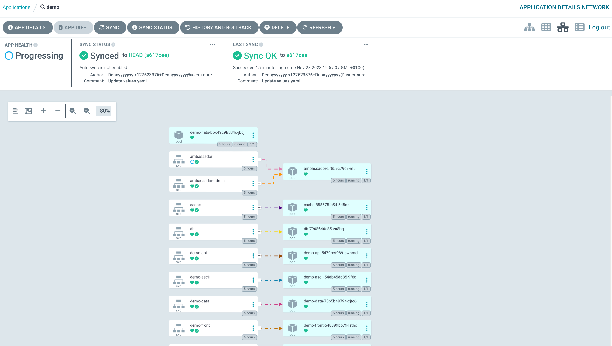
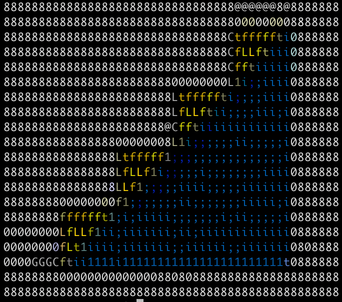

## Minimum Viable Product (MVP)

`Objective:`
Create the `AsciiArtify` app as a minimal viable product with the basic features needed to test the product in order to add additional features, fix bugs, and improve the product based on feedback from users.

`Documentation:`
The MVP documentation should be more detailed compared to the PoC. Obviously, this includes defining functional requirements, GUI design, application architecture, testing, scaling strategy, and implementation plan.

So let's check out the `AsciiArtify` app. First, we forward the ports with the following command

```sh
$ k port-forward -n demo svc/ambassador 8081:80&
[1] 18497
Forwarding from 127.0.0.1:8081 -> 80
Forwarding from [::1]:8081 -> 80
Handling connection for 8081
```

Make a request to the specified port and get a response in the form of the application version

```sh
$ curl localhost:8081
k8sdiy-api:599e1af
```

Everything seems to be fine, but `ArgoCD` doesn't agree with it, so it's most likely an error in the configuration files

Solving issues with configuration files.<br>
After our previous experiments, let's change the network settings of our application again

```sh
$ k get svc -n demo
NAME               TYPE           CLUSTER-IP      EXTERNAL-IP   PORT(S)                                                 AGE
demo-nats          ClusterIP      None            <none>        4222/TCP,6222/TCP,8222/TCP,7777/TCP,7422/TCP,7522/TCP   5h2m
demo-ascii         ClusterIP      10.43.120.251   <none>        80/TCP                                                  5h2m
db                 ClusterIP      10.43.30.4      <none>        3306/TCP                                                5h2m
ambassador-admin   ClusterIP      10.43.178.225   <none>        8877/TCP                                                5h2m
demo-front         ClusterIP      10.43.125.254   <none>        80/TCP                                                  5h2m
demo-img           ClusterIP      10.43.63.22     <none>        80/TCP                                                  5h2m
demo-api           ClusterIP      10.43.179.218   <none>        80/TCP                                                  5h2m
cache              ClusterIP      10.43.67.234    <none>        6379/TCP                                                5h2m
demo-data          ClusterIP      10.43.31.79     <none>        80/TCP                                                  5h2m
ambassador         **LoadBalancer**   10.43.38.151    <pending>     80:32113/TCP                                            5h2m
```
Go to the `ArgoCD` interface, where we will see that the health status of the ambassador application is undefined, find and fix it.



Make changes in the repository with conf helm files in file [values.yaml](https://github.com/Dennyyyyyyy/go-demo-app/blob/master/helm/values.yaml), change `api-gateway` to `NodePort` and commit the changes.
Check one more time

```sh
$ k get svc -n demo
NAME               TYPE        CLUSTER-IP      EXTERNAL-IP   PORT(S)                                                 AGE
demo-nats          ClusterIP   None            <none>        4222/TCP,6222/TCP,8222/TCP,7777/TCP,7422/TCP,7522/TCP   5h11m
demo-ascii         ClusterIP   10.43.120.251   <none>        80/TCP                                                  5h11m
db                 ClusterIP   10.43.30.4      <none>        3306/TCP                                                5h11m
ambassador-admin   ClusterIP   10.43.178.225   <none>        8877/TCP                                                5h11m
demo-front         ClusterIP   10.43.125.254   <none>        80/TCP                                                  5h11m
demo-img           ClusterIP   10.43.63.22     <none>        80/TCP                                                  5h11m
demo-api           ClusterIP   10.43.179.218   <none>        80/TCP                                                  5h11m
cache              ClusterIP   10.43.67.234    <none>        6379/TCP                                                5h11m
demo-data          ClusterIP   10.43.31.79     <none>        80/TCP                                                  5h11m
ambassador         **NodePort**    10.43.38.151    <none>        80:32113/TCP                                            5h11m
```

Now we can test the application after fixing errors.<br>
Select a file from our local storage and upload it to the remote server with this command

```sh
$ curl -F 'image=@images.png' localhost:8081/img/
````
And get our result right in the console



***Follow the link to watch a short video demonstration*** [CLICK ME](https://asciinema.org/a/jE0RoHyTi0YUTSapDXYmjoVmR)
