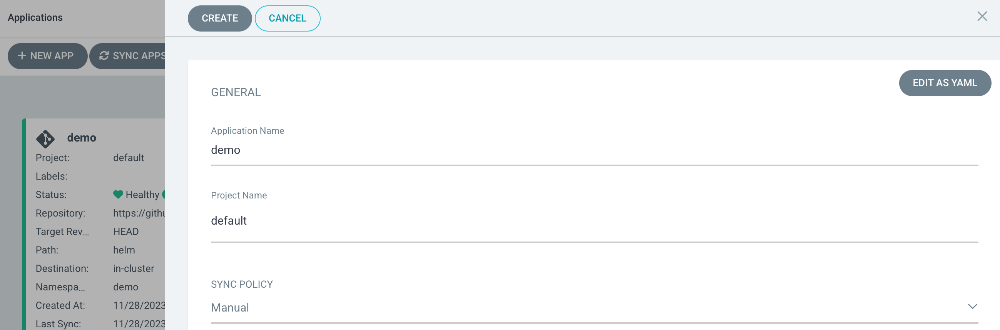
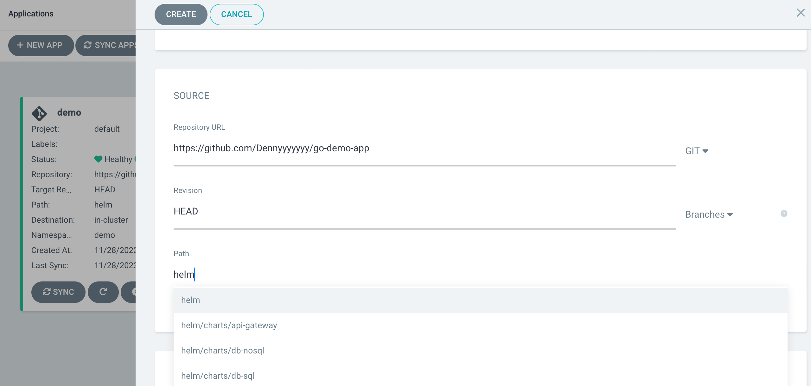
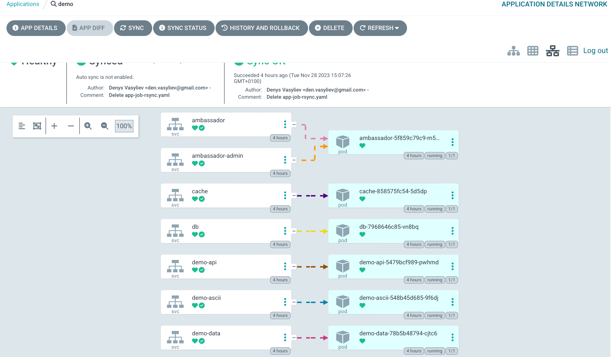
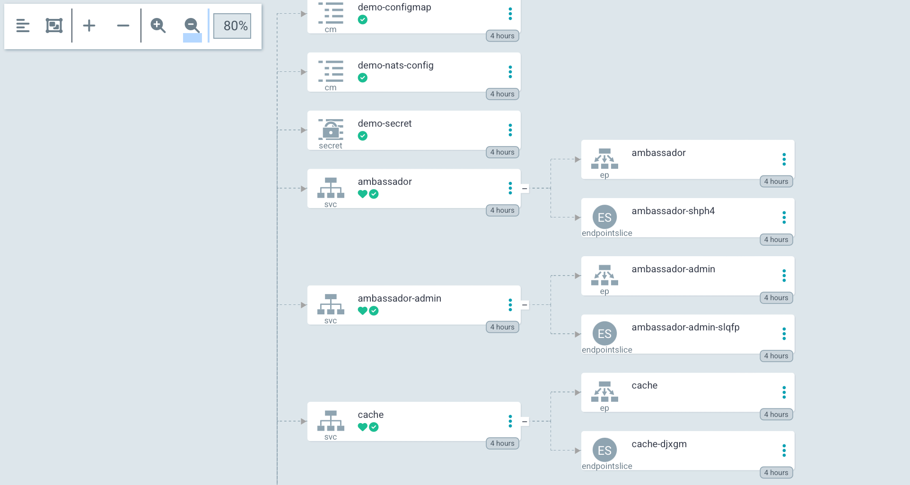
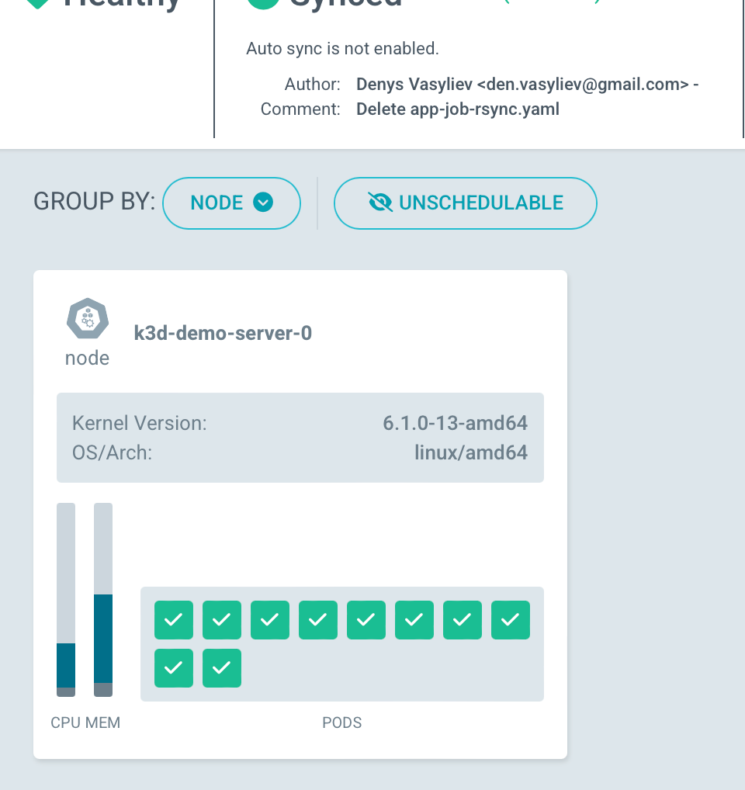
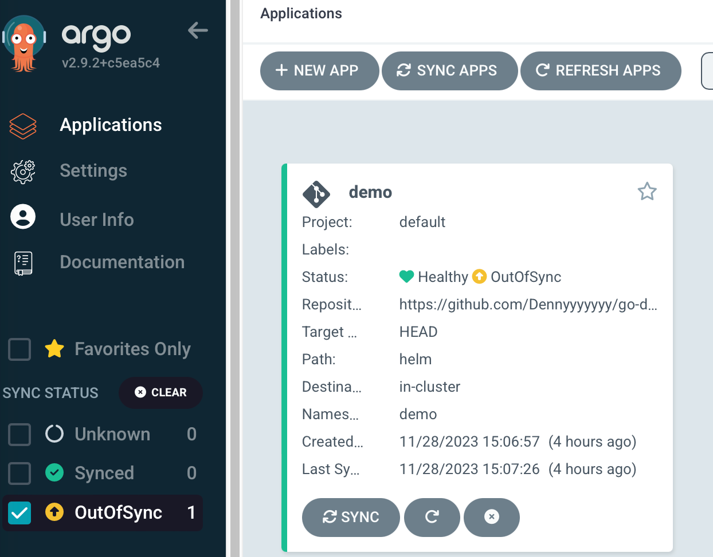

## Proof of Concept ArgoCD
`Objective:` Use the concept of using ArgoCD as a CD tool.  Willing prove the technical and conceptual viability and the ability to technically implement the idea.

`Documentation:` Documentation means a brief description of the concept and analysis of technical capabilities. It also demonstrates a short execution plan with a selected technology stack, considers technical scenarios, and shows metrics.

Using this example, we will get a simple and reliable starter set of tools and practices for deploying applications of any complexity. Essentially, we need nothing only [our repository](https://github.com/Dennyyyyyyy/go-demo-app) and some code to automate	the entire CI process from build to artifact.

For experimental purposes, we will choose the "one application one cluster" approach. For this purpose, so use a "single host kubernetes cluster" and select [ArgoCD](https://argo-cd.readthedocs.io/en/stable/) as the Delivery and Deploy system for the test environment.

`Architecture:`


`How it works:` [link to official site](https://argo-cd.readthedocs.io/en/stable/#how-it-works "Permanent link")

`ArgoCD` follows the  ***GitOps*** pattern of using Git repositories as the source of truth for defining the desired application state. Kubernetes manifests can be specified in several ways:
-   [kustomize](https://kustomize.io/)  applications
-   [helm](https://helm.sh/)  charts
-   [jsonnet](https://jsonnet.org/)  files
-   Plain directory of YAML/json manifests
-   Any custom config management tool configured as a config management plugin

`ArgoCD` is a cubernetes controller that continuously monitors running applications and compares the current state with the desired state. As stated in the repository, a diplomat whose current state	deviates from the target state is considered ***Out of Sync***, and argocd informs and visualizes differences, providing an option for automatic or manual synchronization	the desired state.

1. So before you start installing `ArgoCD`, let's prepare a separate local cluster 
```sh
$ k3d cluster create argo
... 
INFO[0029] Cluster 'argo' created successfully!         
INFO[0029] You can now use it like this: kubectl cluster-info

$ kubectl cluster-info
Kubernetes control plane is running at https://0.0.0.0:43297
CoreDNS is running at https://0.0.0.0:43297/api/v1/namespaces/kube-system/services/kube-dns:dns/proxy
Metrics-server is running at https://0.0.0.0:43297/api/v1/namespaces/kube-system/services/https:metrics-server:https/proxy

$ k version
$ k get all -A
```
2. `ArgoCD` can sometimes be installed with a helm, and we'll do that next time. For now, let's use the installation file from the official Argo`s repository. To begin with, we'll use it to create an Argos list with actions that will install the system by default. It's a good practice to check the contents of the file beforehand if you're not sure of its source. 
```sh
$ kubectl create namespace argocd
namespace/argocd created

$ k get ns
NAME              STATUS   AGE
kube-system       Active   65m
default           Active   65m
kube-public       Active   65m
kube-node-lease   Active   65m
argocd            Active   13s

$ kubectl apply -n argocd -f https://raw.githubusercontent.com/argoproj/argo-cd/stable/manifests/install.yaml

$ k get all -n argocd
 
$ k get pod -n argocd -w
NAME                                                READY   STATUS    RESTARTS   AGE
argocd-redis-b5d6bf5f5-sqlgw                        1/1     Running   0          1m23s
argocd-notifications-controller-589b479947-fm4kp    1/1     Running   0          1m23s
argocd-applicationset-controller-6f9d6cfd58-9rvjf   1/1     Running   0          1m23s
argocd-dex-server-6df5d4f8c4-nd829                  1/1     Running   0          1m23s
argocd-application-controller-0                     1/1     Running   0          1m23s
argocd-server-7459448d56-xnrvf                      1/1     Running   0          1m23s
argocd-repo-server-7b75b45897-qsw9z                 1/1     Running   0          1m23s
```
3. After installing the system, we need to access the `ArgoCD GUI`. This can be done using node-port or loadbalancer, which can be configured for the `ArgoCD server` service. Let's use port-forward to access Argo using local port 8080. We will link to the argocd-server service, which is located in the argocd namespace, kubectl will automatically find the service and install a portmap from local port 8080 to remote port 443
```sh
$ k port-forward --address 0.0.0.0 svc/argocd-server -n argocd 8080:443&
[2] 13528
Forwarding from 0.0.0.0:8080 -> 8080
Handling connection for 8080
```
`ArgoCD` works with https by default, so when you try to open `localhost:8080`, you will get a certificate error. So, in a productive system, you need to install certificates and configure these issues.

4. Now we need to get the password to log in to the system. Let's use the kubectl get secret command. Specify the name of the script, as well as the format of the output json path .data.password This will return the base64 encoded password. We use pipe base64 -D to get the password in plain text
```sh
k -n argocd get secret argocd-initial-admin-secret -o jsonpath="{.data.password}" | base64 -d;echo
lLMOQyfflxdQCjbM
```
5. After logging in, create the application using the `GUI`. From now on, applications configured in `ArgoCD` will be automatically set to be updated in Kubernetes.



And enter the url of the repository that contains the manifests for deployment (this will be helm charts, or a package of manifests that is a group of objects for Kubernetes and our application). In the Path field, enter the path to the helm directory.

In the `DESTINATION` section, specify the url of the local cluster and the Namespace demo, after which `ArgoCD` will automatically determine the application parameters using the manifests in the repository.
Create an application with the ***CREATE*** button.

6. `ArgoCD` provides a graphical interface for visualizing the deployment status and architecture of applications deployed using this system. The graphical view provides a hierarchical view of the application components, their deployment, and current state in the cubernetes cluster.



7. `Synchronize the program`
In the program information window, click the ***SYNC*** button
In the pop-up window, select the components and synchronization modes and click the ***SYNCHRONIZE*** button.
The synchronization process will start, and we can track its progress in the `Program Details` window. Once it is complete, we can verify that the application is deployed correctly by checking its status in the cluster.


8. And now let's see how `ArgoCD` reacts to changes in the repository.
Make changes to the [values.yaml](https://github.com/Dennyyyyyyy/go-demo-app/blob/master/helm/values.yaml) file 
If there are differences between the two states, Argo will apply the necessary changes to bring the application to the desired state. In the case when we change the Helm value, for example, we will change the service type from `LoadBalancer` to `NodePort` and commit the changes.

```sh
$ k get svc -n demo
NAME               TYPE           CLUSTER-IP      EXTERNAL-IP   PORT(S)                                                 AGE
demo-nats          ClusterIP      None            <none>        4222/TCP,6222/TCP,8222/TCP,7777/TCP,7422/TCP,7522/TCP   4h10m
demo-ascii         ClusterIP      10.43.120.251   <none>        80/TCP                                                  4h10m
db                 ClusterIP      10.43.30.4      <none>        3306/TCP                                                4h10m
ambassador-admin   ClusterIP      10.43.178.225   <none>        8877/TCP                                                4h10m
demo-front         ClusterIP      10.43.125.254   <none>        80/TCP                                                  4h10m
demo-img           ClusterIP      10.43.63.22     <none>        80/TCP                                                  4h10m
demo-api           ClusterIP      10.43.179.218   <none>        80/TCP                                                  4h10m
cache              ClusterIP      10.43.67.234    <none>        6379/TCP                                                4h10m
demo-data          ClusterIP      10.43.31.79     <none>        80/TCP                                                  4h10m
ambassador         LoadBalancer   10.43.38.151    <pending>     80:32113/TCP                                            4h10m
```

The synchronization process retrieves the latest version of the `Git` repository and compares it to the current state, detects that the service type for ambassador has changed from `LoadBalancer` to `NodePort`, and updates the Kubernetes manifest accordingly.

```sh
$ k get svc -n demo
NAME               TYPE        CLUSTER-IP      EXTERNAL-IP   PORT(S)                                                 AGE
demo-nats          ClusterIP   None            <none>        4222/TCP,6222/TCP,8222/TCP,7777/TCP,7422/TCP,7522/TCP   4h12m
demo-ascii         ClusterIP   10.43.120.251   <none>        80/TCP                                                  4h12m
db                 ClusterIP   10.43.30.4      <none>        3306/TCP                                                4h12m
ambassador-admin   ClusterIP   10.43.178.225   <none>        8877/TCP                                                4h12m
demo-front         ClusterIP   10.43.125.254   <none>        80/TCP                                                  4h12m
demo-img           ClusterIP   10.43.63.22     <none>        80/TCP                                                  4h12m
demo-api           ClusterIP   10.43.179.218   <none>        80/TCP                                                  4h12m
cache              ClusterIP   10.43.67.234    <none>        6379/TCP                                                4h12m
demo-data          ClusterIP   10.43.31.79     <none>        80/TCP                                                  4h12m
ambassador         NodePort    10.43.38.151    <none>        80:32113/TCP                                            4h12m
```
